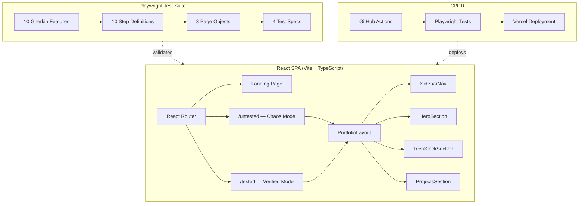

# QA Automation Engineer Portfolio 🚀

<div align="center">
  
</div>

<br/>

<div align="center">

> ### 🔴 Untested Mode &nbsp;&nbsp; | &nbsp;&nbsp; 🟢 Verified Mode
> **Find the hidden bugs** &nbsp;&nbsp;&nbsp;&nbsp;&nbsp;&nbsp;&nbsp;&nbsp;&nbsp;&nbsp;&nbsp;&nbsp;&nbsp;&nbsp;&nbsp; **See the validated fixes**
> <br/>
> <a href="https://www.miltonklun.com/untested"></a> &nbsp;&nbsp;&nbsp;&nbsp;&nbsp;&nbsp;&nbsp;&nbsp;&nbsp;&nbsp;&nbsp;&nbsp;&nbsp;&nbsp; <a href="https://www.miltonklun.com/tested"></a>

</div>

---

## 💡 What Is This?

An interactive portfolio that **shows** QA skills instead of just listing them. The same website exists in two states — one full of deliberate bugs, and one where every issue has been found, documented, and fixed.

- **Untested Mode**: Chaos-engineered with 5 hidden bugs (broken layouts, flickering names, dead links, API failures). Click on glitches to see Jira-style bug reports with root cause analysis.
- **Verified Mode**: Every bug is resolved. Click green checkmarks to see how each issue was fixed and validated.

---

## 🏗️ Architecture



---

## 🛠️ Tech Stack

| Layer | Technology |
|-------|-----------|
| **Framework** | React 18 + TypeScript |
| **Build Tool** | Vite |
| **Styling** | Tailwind CSS |
| **Animations** | Framer Motion |
| **UI Components** | Radix UI (shadcn/ui) |
| **E2E Testing** | Playwright |
| **BDD** | Cucumber / Gherkin |
| **CI/CD** | GitHub Actions |
| **Hosting** | Vercel |
| **Analytics** | Vercel Analytics |

---

## 🧪 Test Strategy

### Page Object Model (POM)
```
tests/
├── pages/          # Page Objects (BasePage, UntestedPage, TestedPage)
├── specs/          # 4 Playwright test specs
└── steps/          # 10 BDD step definitions
```

### BDD Feature Coverage
```
qa-artifacts/features/
├── untested_mode.feature      # Broken behavior scenarios
├── tested_mode.feature        # Fixed behavior scenarios
├── bug_reporting.feature      # Interactive bug report modals
├── bug_hints.feature          # Bug discovery hint system
├── verified_checks.feature    # Fix verification badges
├── enhanced_bugs.feature      # Advanced chaos-engineered bugs
├── accessibility.feature      # WCAG compliance checks
├── mobile_navigation.feature  # Responsive layout tests
├── performance.feature        # Lighthouse score targets
└── visual_regression.feature  # Screenshot comparison tests
```

### Running Tests

```bash
# Install dependencies
npm install

# Run all Playwright tests
npx playwright test

# Run with UI mode
npx playwright test --ui

# Run specific scenarios
npx playwright test --grep "Verified"
```

---

## 📂 Project Structure

```
qa-showcase/
├── src/
│   ├── components/portfolio/   # Page sections (Hero, TechStack, Projects)
│   ├── components/ui/          # Reusable UI primitives (shadcn/ui)
│   ├── hooks/                  # Custom React hooks
│   └── pages/                  # Route components (Index, Untested, Tested)
├── tests/                      # Playwright E2E tests (POM pattern)
├── qa-artifacts/               # Gherkin features, test docs, Lighthouse reports
├── IMPROVEMENTS_PLAN.md        # 6-phase development roadmap
└── TEST_FIX_PLAN.md            # Bug documentation and fix tracking
```

---

## 🚀 Local Development

```bash
# Clone and install
git clone https://github.com/MiltonKlun/QA_Portfolio.git
cd QA_Portfolio
npm install

# Start dev server
npm run dev

# Production build
npm run build
npm run preview
```

---

## Author

**Milton Klun**  
*QA Automation Engineer | Backend Developer*

<div align="left">
  <a href="https://www.linkedin.com/in/milton-klun/"></a><a href="mailto:miltonericklun@gmail.com"></a><a href="https://www.miltonklun.com"></a>
</div>
